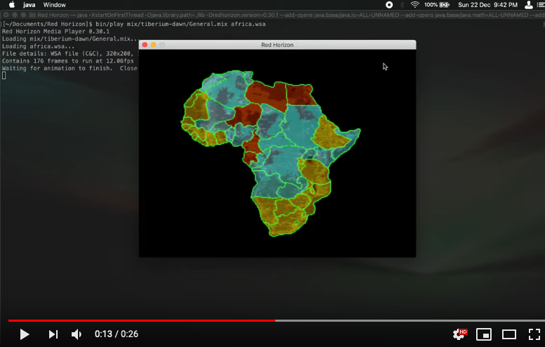

Red Horizon
===========

[](https://github.com/ultraq/redhorizon/actions)
[](https://github.com/ultraq/redhorizon/releases/latest)

This repository is an archive of work I started several years ago to attempt to
recreate the original 2D Command & Conquer (C&C) games.  The most useful outcome
of this project has been a set of file conversion tools and working code
examples of how to decode/encode various file formats from those games.

While I don't think I have the time any more to fulfil the original goal of
running the original Red Alert campaign missions with this (there's that [C&C
Remaster project](https://www.ea.com/en-gb/games/command-and-conquer/command-and-conquer-remastered)
now!), I update this project every so often when I feel the urge to work on
smaller things like graphics rendering, playing sounds, creating good CLI tools,
and general software architecture for games as opposed to my day-to-day which is
web development.

These smaller goals can be observed as [milestones](https://github.com/ultraq/redhorizon/milestones)
on GitHub, so you can follow along there.


Installation
------------

Requires Java 17 on macOS 10.15 Catalina and newer, or Windows 10 64-bit and
newer, with graphics hardware that supports OpenGL 4.1+.

Download the distribution bundle from the [project releases](https://github.com/ultraq/redhorizon/releases)
page, then unzip it to somewhere on your computer.


CLI Tools
---------

### convert

The main file conversion utility under which more specialized converters exist
as subcommands.

```
Usage: redhorizon convert [-hV] COMMAND
  -h, --help      Show this help message and exit.
  -V, --version   Print version information and exit.
Commands:
  pcx2cps  Convert a PCX file to a Command & Conquer CPS file
  png2shp  Convert a paletted PNG file to a Command & Conquer SHP file
```

#### convert pcx2cps

```
Usage: redhorizon convert pcx2cps <sourceFile> <destFile>
Convert a PCX file to a Command & Conquer CPS file
      <sourceFile>   A 320x200 PCX image.  If creating a paletted CPS, then the
                       PCX file must have an internal palette.
      <destFile>     Path for the CPS file to be written to.
```

#### convert png2shp

```
Usage: redhorizon convert png2shp -h=<height> -n=<numImages> -w=<width>
                                  <sourceFile> <destFile>
Convert a paletted PNG file to a Command & Conquer SHP file
      <sourceFile>        The sounce PNG image.
      <destFile>          Path for the SHP file to be written to.
  -h, --height=<height>   Height of each SHP image
  -n, --numImages=<numImages>
                          The number of images for the SHP file
  -w, --width=<width>     Width of each SHP image
```

### explorer

A file explorer-like interface for viewing classic C&C file formats, including
peeking inside MIX files.

```
Usage: redhorizon explorer [--palette=<paletteType>]
      --palette=<paletteType>
         Which game palette to apply to a paletted image.  One of ra-snow,
           ra-temperate, td-temperate.  Defaults to ra-temperate
```

### mix

A MIX file reader for extracting files from them.

```
Usage: redhorizon mix [-hV] <mixFile> <entryName>
Extract an entry from a mix file, saving it to disk with the same name.
      <mixFile>     Path to the mix file to read
      <entryName>   Name of the entry in the mix file
  -h, --help        Show this help message and exit.
  -V, --version     Print version information and exit.
```

### play

A media player for viewing or playing back various C&C media formats.

```
Usage: redhorizon play [-hV] [--filter] [--fix-aspect-ratio] [--full-screen]
                       [--scale-low-res] [--scanlines]
                       [--palette=<paletteType>] <file> [<entryName>]
Play/View a variety of supported media formats
      <file>               Path to the file to open, or a mix file that
                             contains the target object
      [<entryName>]        If <file> is a mix file, this is the name of the
                             object in the mix file to open
      --filter             Use nearest-neighbour filtering to smooth the
                             appearance of images
      --fix-aspect-ratio   Adjust the aspect ratio for modern displays
      --full-screen        Run in fullscreen mode
  -h, --help               Show this help message and exit.
      --palette=<paletteType>
                           Which game palette to apply to a paletted image.
                             One of ra-snow, ra-temperate, td-temperate.
                             Defaults to ra-temperate
      --scale-low-res      Double the output resolution of low-res animations
                             and videos (320x200 or lower).  Useful in
                             conjunction with filtering so that the result is
                             still filtered but less blurry.
      --scanlines          Add scanlines to the image, emulating the look of
                             images on CRT displays
  -V, --version            Print version information and exit.
```

Demo of WSA (animation format) playback on YouTube (note the command line path
is old as all commands have been moved to be subcommands of `redhorizon`):

[](https://www.youtube.com/watch?v=mp7A6EMWupY)

[Demo of VQA (video format) playback on YouTube](https://www.youtube.com/watch?v=3jpLoEJ22xc)

### view

Unit/structure and map viewer.  Currently supports only a handful of units -
those which I have built configuration files for - and non-interior theater
maps.

```
Usage: redhorizon view [-hV] [--full-screen] [--palette=<paletteType>] <file>
                       [<entryName>]
      <file>          Path to the file to open, or a mix file that contains the
                        target object
      [<entryName>]   If <file> is a mix file, this is the name of the object
                        in the mix file to open
      --full-screen   Run in fullscreen mode
  -h, --help          Show this help message and exit.
      --palette=<paletteType>
                      Which game palette to apply to a paletted image.  One of
                        ra-snow, ra-temperate, td-temperate.  Defaults to
                        ra-temperate
  -V, --version       Print version information and exit.
```

[Demo of the unit viewer on YouTube](https://www.youtube.com/watch?v=UihLl4ALbnw)

[Demo of the map viewer on YouTube](https://youtu.be/zPHCF8BfkKU)
