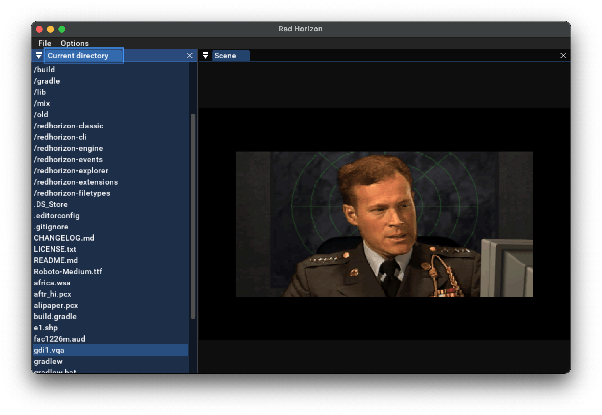
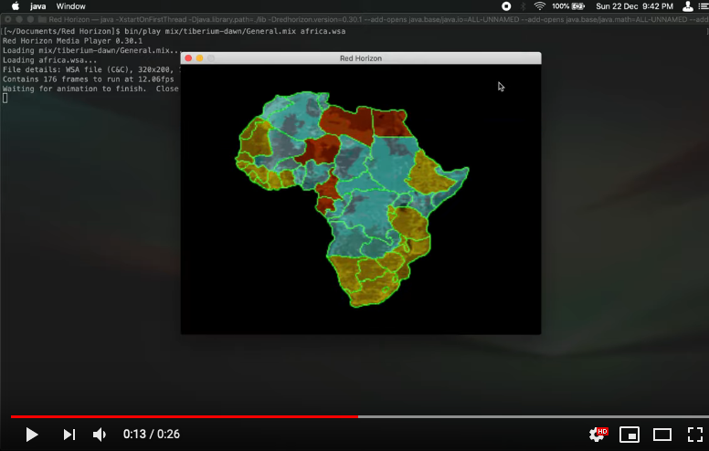

Red Horizon - CLI
=================

A collection of command-line tools that serve as entry points to the Red Horizon
project's capabilities.


Installation
------------

Requires Java 21 on macOS 12 Monterey and newer, or Windows 10 64-bit and newer.

Download the distribution bundle from the [project releases](https://github.com/ultraq/redhorizon/releases)
page, then unzip it to somewhere on your computer.


CLI tools
---------

### convert

The main file conversion utility under which more specialized converters exist
as subcommands.

```
Usage: redhorizon convert [-hV] COMMAND
  -h, --help      Show this help message and exit.
  -V, --version   Print version information and exit.
Commands:
  pcx2cps    Convert a PCX file to a Command & Conquer CPS file
  png2shp    Convert a paletted PNG file to a Command & Conquer SHP file
  png2shpd2  Convert a paletted PNG file to a Dune 2 SHP file
```

#### convert pcx2cps

```
Usage: redhorizon convert pcx2cps <sourceFile> <destFile>
Convert a PCX file to a Command & Conquer CPS file
      <sourceFile>   A 320x200 PCX image.  If creating a paletted CPS, then the
                       PCX file must have an internal palette.
      <destFile>     Path for the CPS file to be written to.
```

#### convert png2shp

```
Usage: redhorizon convert png2shp -h=<height> -n=<numImages> -w=<width>
                                  <sourceFile> <destFile>
Convert a paletted PNG file to a Command & Conquer SHP file
      <sourceFile>        The sounce PNG image.
      <destFile>          Path for the SHP file to be written to.
  -h, --height=<height>   Height of each SHP image
  -n, --numImages=<numImages>
                          The number of images for the SHP file
  -w, --width=<width>     Width of each SHP image
```

#### convert png2shpd2

```
Usage: redhorizon convert png2shpd2 [--faction] -h=<height> -n=<numImages>
                                    -w=<width> <sourceFile> <destFile>
Convert a paletted PNG file to a Dune 2 SHP file
      <sourceFile>        The sounce PNG image.
      <destFile>          Path for the SHP file to be written to.
      --faction           Generate a SHP file whose red-palette colours
                            (indexes 144-150) will be exchanged for the proper
                            faction colours in-game.
  -h, --height=<height>   Height of each SHP image
  -n, --numImages=<numImages>
                          The number of images for the SHP file
  -w, --width=<width>     Width of each SHP image
```

### explorer

A file explorer-like interface for viewing classic C&C file formats, including
peeking inside MIX files.

```
Usage: redhorizon explorer [--palette=<paletteType>]
      --palette=<paletteType>
         Which game palette to apply to a paletted image.  One of ra-snow,
           ra-temperate, td-temperate.  Defaults to ra-temperate
```



### mix

A MIX file reader for extracting files from them.

```
Usage: redhorizon mix [-hV] <mixFile> <entryName>
Extract an entry from a mix file, saving it to disk with the same name.
      <mixFile>     Path to the mix file to read
      <entryName>   Name of the entry in the mix file
  -h, --help        Show this help message and exit.
  -V, --version     Print version information and exit.
```

### play

A media player for viewing or playing back various C&C media formats.

```
Usage: redhorizon play [-hV] [--full-screen] [--maximized] [--scanlines]
                       [--palette=<paletteType>] [--volume=<volume>] <file>
                       [<entryName>]
Play/View a variety of supported media formats
      <file>              Path to the file to open, or a mix file that contains
                            the target object
      [<entryName>]       If <file> is a mix file, this is the name of the
                            object in the mix file to open
      --full-screen       Start in full screen mode.  Windows only, macOS users
                            can use the full screen button for full screen mode
  -h, --help              Show this help message and exit.
      --maximized         Use a maximized window
      --palette=<paletteType>
                          Which game palette to apply to a paletted image.  One
                            of ra-snow, ra-temperate, td-temperate.  Defaults
                            to ra-temperate
      --scanlines         Add scanlines to the image, emulating the look of
                            images on CRT displays
  -V, --version           Print version information and exit.
      --volume=<volume>   The volume level, as a number from 0-100.  Defaults
                            to 50
```

Demo of WSA (animation format) playback on YouTube (note the command line path
is old as all commands have been moved to be subcommands of `redhorizon`):

[](https://www.youtube.com/watch?v=mp7A6EMWupY)

[Demo of VQA (video format) playback on YouTube](https://www.youtube.com/watch?v=3jpLoEJ22xc)

### view

Unit/structure and map viewer. Currently supports only a handful of units -
those which I have built configuration files for - and non-interior theater
maps.

```
Usage: redhorizon view [-hV] [--full-screen] [--maximized] [--scanlines]
                       [--touchpad-input] [--palette=<paletteType>] <file>
                       [<entryName>]
      <file>             Path to the file to open, or a mix file that contains
                           the target object
      [<entryName>]      If <file> is a mix file, this is the name of the
                           object in the mix file to open
      --full-screen      Start in full screen mode.  Windows only, macOS users
                           can use the full screen button for full screen mode
  -h, --help             Show this help message and exit.
      --maximized        Use a maximized window
      --palette=<paletteType>
                         Which game palette to apply to a paletted image.  One
                           of ra-snow, ra-temperate, td-temperate.  Defaults to
                           ra-temperate
      --scanlines        Add scanlines to the image, emulating the look of
                           images on CRT displays
      --touchpad-input   Use touchpad scroll gestures to navigate
  -V, --version          Print version information and exit.
```

[Demo of the unit viewer on YouTube](https://www.youtube.com/watch?v=UihLl4ALbnw)

[Demo of the map viewer on YouTube](https://youtu.be/zPHCF8BfkKU)
